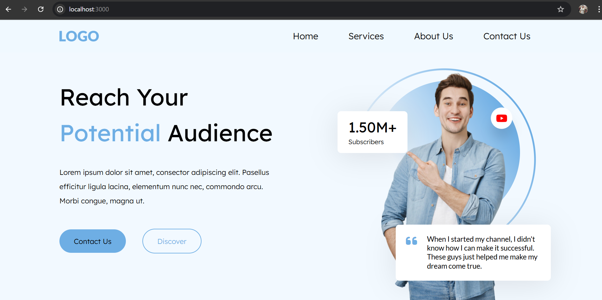
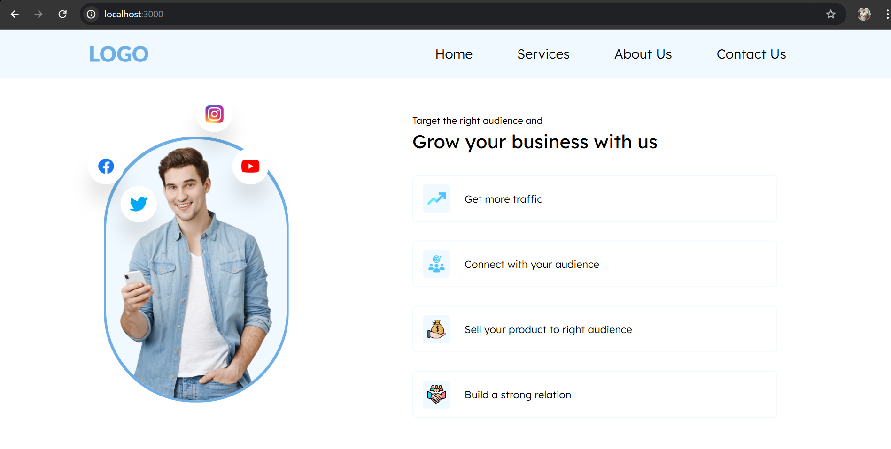
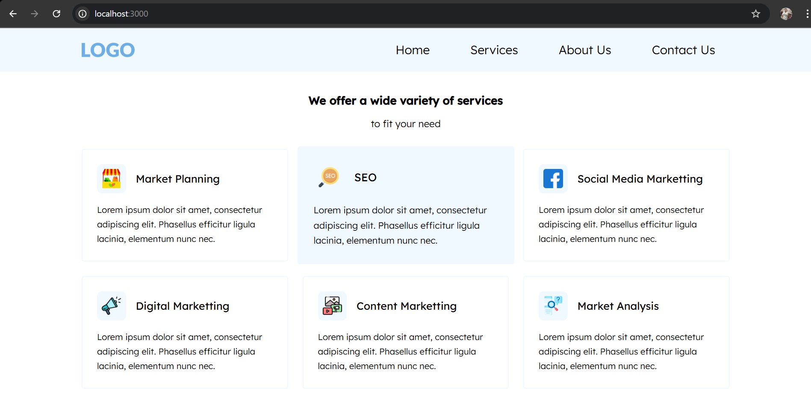
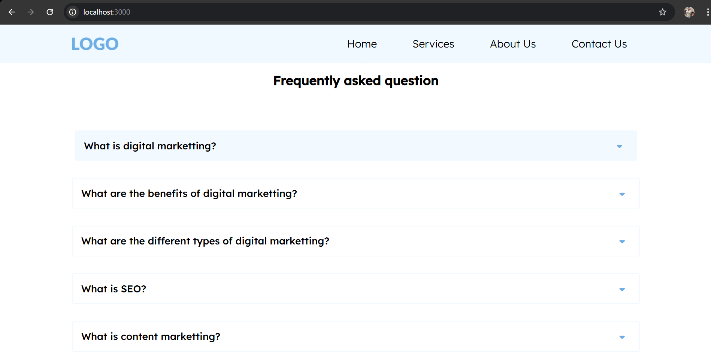
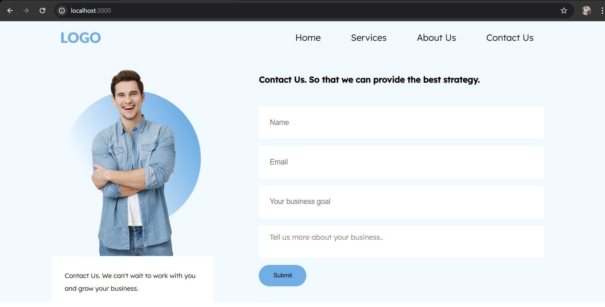
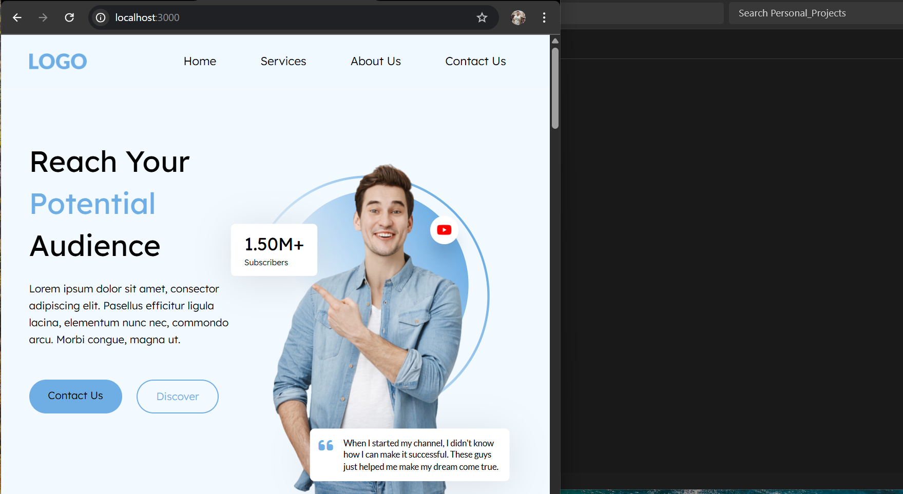

# Digital Marketing Website

A modern, responsive website designed to showcase digital marketing services and solutions.

## Features
- Responsive design for all devices

## Technologies Used
- HTML5, CSS3, JavaScript


## Getting Started
1. Clone the repository:
    ```bash
    git clone https://github.com/your-username/digital-marketing-website.git
    ```
2. Navigate to the project directory:
    '''
    right-click on html file and choose live server to get a preview
    '''

## Screenshots










